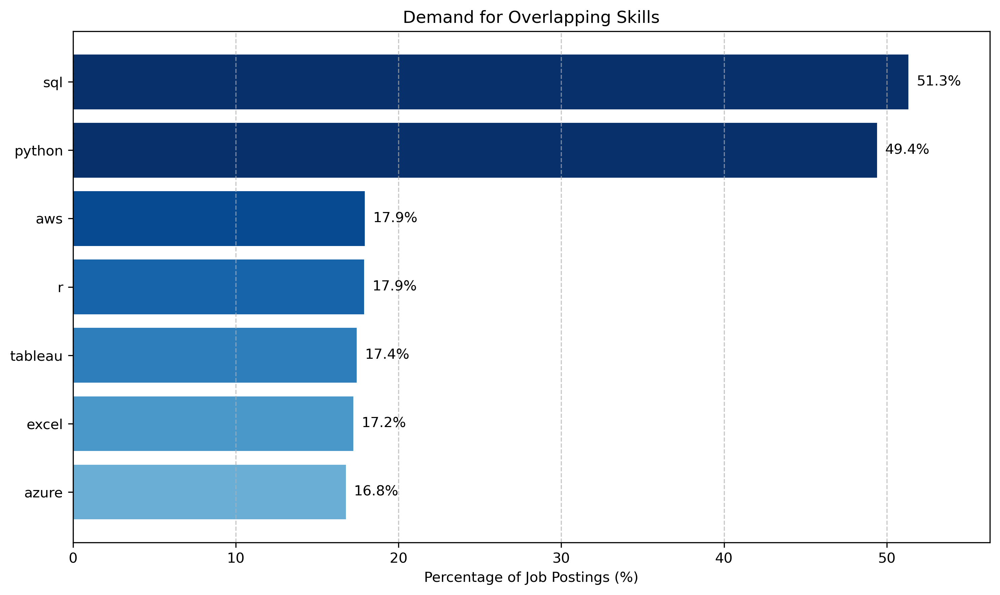
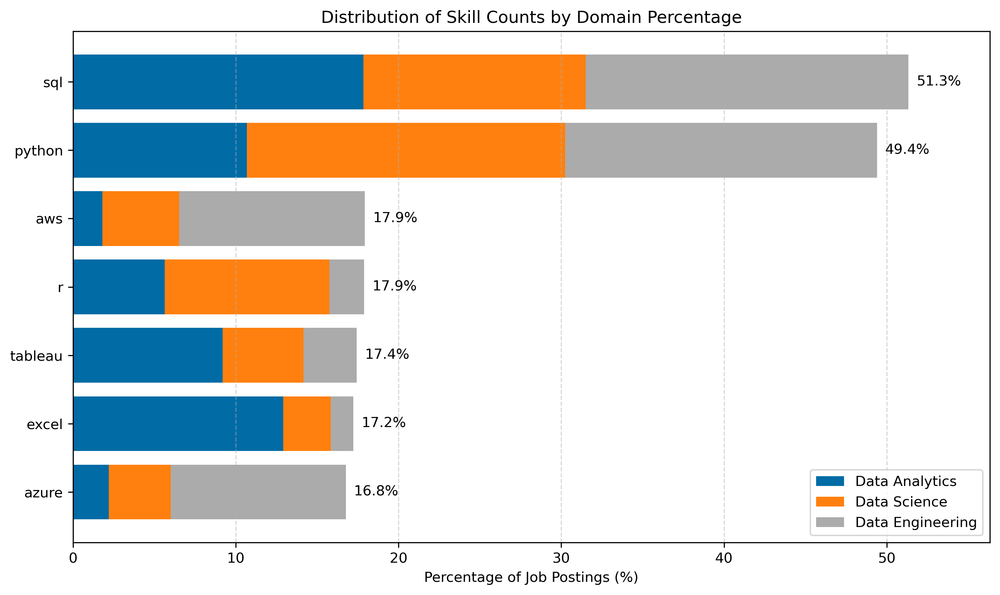
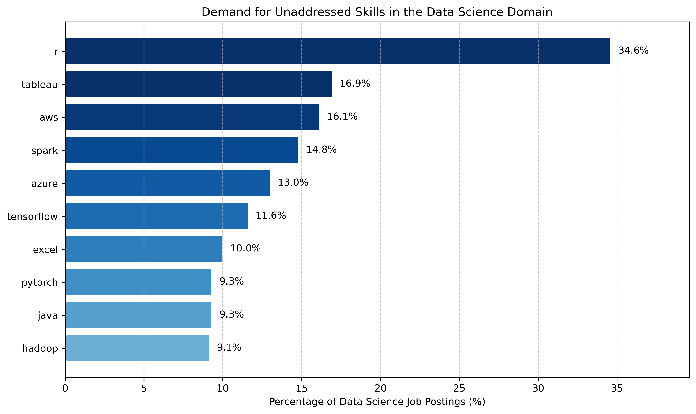
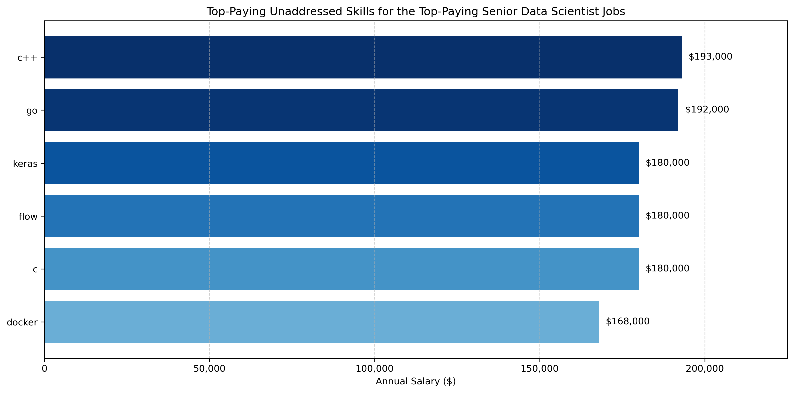
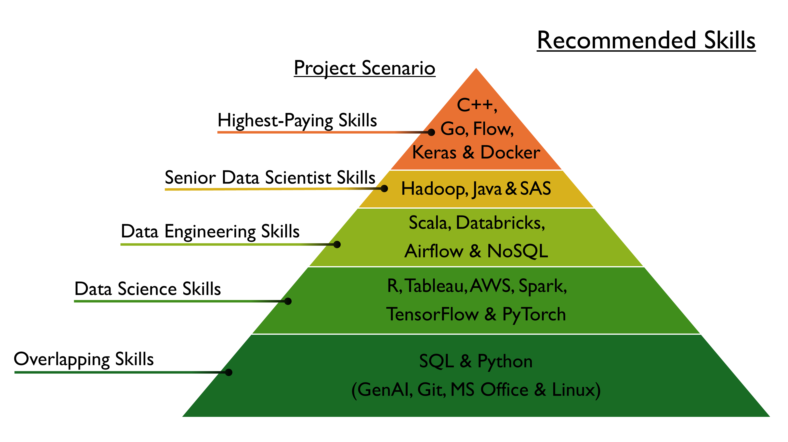
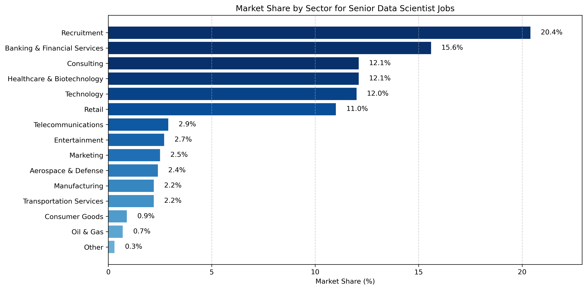
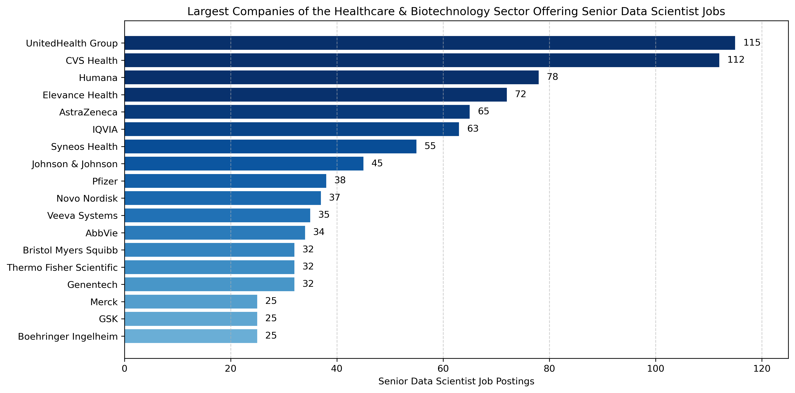
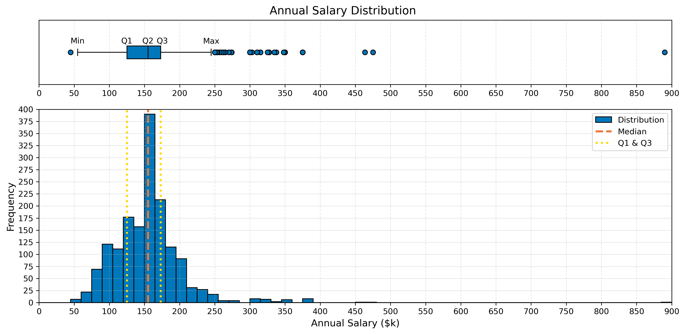

<h1 style="text-align:center;">SQL & Python Project: Exploring In-Demand Skills for Data Professionals</h1>

<h2 style="text-align:left;">Introduction</h2>

<u><h3 style="text-align:left;">About this Project</h3></u>

This project aims to help aspiring data professionals navigate the dynamic and multidisciplinary field of Data Science by identifying the most important data-related skills to target. It serves as a comprehensive guide, equipping learners with relevant skills and essential information to effectively carve their own career paths and enhance their market value.

<u><h3 style="text-align:left;">Dataset</h3></u>

The dataset used in this project is sourced from Luke Barousse ([dataset](https://www.lukebarousse.com/sql)) and consists of approximately 800,000 job postings, of which 716,215 entries are specifically for the data science industry. These postings cover the three main disciplines of this industry, namely the Data Analytics, Data Science, and Data Engineering domains, and represent real-world job openings collected from Google's search results spanning from December 2022 through December 2023.

<u><h3 style="text-align:left;">Subprojects & Key Questions</h3></u>

The project comprises three subprojects, of which the first is the most important:

<h4 style="text-align:left;">A. <u>Skills</u></h4>

<u>Project Scenario</u>:
- The project follows an aspiring data professional who begins by learning the most in-demand **overlapping** skills from the three data-related domains.
- Next, they focus on acquiring the most sought-after skills specific to the **Data Science** domain.
- Then, they expand their knowledge by learning key in-demand skills within the **Data Engineering** domain to gain a foundational understanding of the entire data science pipeline.
- Finally, they decide to specialize in the Data Science domain by targeting both the **most in-demand** and the **highest-paying** skills required for **senior-level roles**.

<u>Key Questions Addressed</u>:
- What are the most in-demand **overlapping** skills from all three data-related domains?
- What are the most in-demand skills in the Data **Science** domain?
- What are the most in-demand skills in the Data **Engineering** domain?
- What are the **most in-demand** skills for the **Senior** Data Scientist role?
- What are the **highest-paying** skills for the Senior Data Scientist role?

<h4 style="text-align:left;">B. <u>Sectors</u></h4>

The remaining two subprojects focus specifically on the Senior Data Scientist job market. On the one hand, the second subproject (B. Sectors) tries to uncover both the sectors and the companies that offer the most Senior Data Scientist positions. On the other hand, the third subproject (C. Salary Distribution) aims to reveal compensation trends reflected in the salary distribution for the same role.

<u>Key Question Addressed</u>:
- Which industry sectors offer the most Senior Data Scientist jobs, and what are some examples of companies in these sectors?

<h4 style="text-align:left;">C. <u>Salary Distribution</u></h4>

<u>Key Question Addressed</u>:
- What insights can be derived from the salary distribution of the Senior Data Scientist role?

 

Comprehensive documentation is available in the following documentation folder: [/docs](/docs/).

<h2 style="text-align:left;">Methodology & Tools Used</h2>

<u><h3 style="text-align:left;">Methodology</h3></u>

Most data collection, storage, and cleaning steps have already been conducted by Luke Barousse in the form of the pre-cleaned database he provides, as the project mainly focuses on data acquisition and visualization.
- <u>Acquiring Data</u>: Retrieving data from the database using SQL commands.
- <u>Communicating Results</u>: Creating visualizations and turning insights into actions by recommending the most important data-related skills.

<u>Process</u>:
- Each subproject begins with one or more *SQL files* that retrieve the relevant data needed to address the corresponding key question.
- Then, one or more *Jupyter Notebook files* follow which prepare and visualize the previously acquired dataset.
- <u>Data Cleaning & Statistics</u>: Whenever necessary (subtask [4_III - Senior Data Scientist role](/4_senior_data_scientist/4_III_highest_paying/)), several data cleaning steps and basic statistics are performed.

<u><h3 style="text-align:left;">Tools Used</h3></u>

A range of essential tools was employed in order to address the key questions of this project:

<h4 style="text-align:left;">1. <u>SQL</u></h4>

- SQL was the programming language that was leveraged to query the database and produce the CSV files of the project.
- PostgreSQL was the relational database management system utilized, which uses SQL as its query language.

<h4 style="text-align:left;">2. <u>Python</u></h4>

Python was the programming language that was used to primarily visualize the datasets of the project, but also to clean them when that was required.
- <u>NumPy</u>
    - First, NumPy was used to create arrays and conduct array operations and basic statistical operations. 
    - For instance, boolean indexing was used throughout the project so that only the items that met a specific condition could be retrieved and statistical functions were utilized so that the basic statistical features of the salary distribution could be extracted.
- <u>Pandas</u>
    - Second, Pandas was employed to read and inspect the CSV files that were produced using SQL, to clean the datasets and manipulate the DataFrames to transform the data when needed, and to export those DataFrames to CSV files so that the respective data could be properly read and then visualized with Matplotlib.
- <u>Matplotlib</u>
    - Third, the visualizations were created by leveraging Matplotlib, a data visualization tool that helps in effectively conveying insights from data analyses.
    - In this project, it was primarily used to create clear and informative horizontal bar charts, as well as a figure combining a histogram and box plot to illustrate the salary distribution for the Senior Data Scientist role.

<h4 style="text-align:left;">3. <u>GenAI</u></h4>

- Perplexity was leveraged to delve into SQL and Python documentation for syntax and best practices.
- ChatGPT, Perplexity, and Claude were utilized for identifying bugs and suggesting debugging strategies in code.
- Perplexity also assisted with organizing the documentation files, correcting grammatical errors, and generating summaries.

<h4 style="text-align:left;">4. <u>VS Code</u></h4>

- VS Code was the code editor employed for writing, editing, and executing the queries and the code blocks of the Jupyter Notebooks of the project.

<h4 style="text-align:left;">5. <u>Markdown</u></h4>

- Markdown was the markup language utilized for formatting the README.md & documentation files.

<h4 style="text-align:left;">6. <u>Git & GitHub</u></h4>

- Git and GitHub were essential tools for version control and sharing this project respectively.

<h2 style="text-align:left;">Key Findings</h2>

<h3 style="text-align:left;">A. <u>Skills</u></h3>

<h4 style="text-align:left;">1. <u>Overlapping Skills</u></h4>

<u>Horizontal Bar Chart</u>:

 

<u>Stacked Bar Chart</u>:

 

<h4 style="text-align:left;">2. <u>Data Science Skills</u></h4>

<u>Bar chart - Unaddressed Skills</u>:

 

| Chosen Skill           | Short Description                     |
|:---------------------|:-------------------------------------|
| R                    | Statistical programming language      |
| Tableau              | Data Visualization Tool              |
| AWS           | Cloud Platforms                      |
| Spark                | Big Data Framework                   |
| TensorFlow & PyTorch | Deep Learning Frameworks             |

<h4 style="text-align:left;">3. <u>Data Engineering Skills</u></h4>

| Chosen Skill           | Short Description                     |
|:-------------:|:----------------------------------------------------------------------------------|
| Scala        | High-level programming language used with Apache Spark for big data processing.   |
| Databricks   | Cloud-based data engineering platform built on Apache Spark.                      |
| Airflow      | Workflow automation tool designed for managing complex data pipelines.            |
| NoSQL        | Category of database management systems that are designed for managing unstructured or semi-structured data (MongoDB/Cassandra). |

<h4 style="text-align:left;">4. <u>Senior Data Scientist Skills</u></h4>

| Chosen Skill   | Short Description                                                                 |
|:-------------:|:----------------------------------------------------------------------------------|
| SAS          | Statistical Software Suite                                                          |
| Hadoop       | Big data framework designed for distributed storage and processing of data.       |
| Java         | High-level programming language designed for building high performance systems. |

<h4 style="text-align:left;">5. <u>Top-Paying Skills for the Senior Data Scientist Role</u></h4>

<u>Bar chart - Unaddressed Skills</u>:

 

| Chosen Skill | Average Salary Per Skill ($) | Short Description |
|:----------:|:------------------------:|-----------------|
| C++ | 193,000 | High-performance programming language used for building data science tools. |
| Go | 192,000 | Modern programming language for concurrent, large-scale data processing. |
| Flow | 180,000 | Flow tools, like Apache NiFi, for automating data flows. |
| Keras | 180,000 | API for building and training neural networks. |
| Docker | 168,000 | Platform for packaging applications with all their dependencies. |

<h4 style="text-align:left;">6. <u>Pyramid Chart</u></h4>

 

<h3 style="text-align:left;">B. <u>Sectors</u></h3>

1. Industry Sectors

 

2. Companies of the Healthcare & Biotechnology Sector

 

<h3 style="text-align:left;">C. <u>Salary Distribution</u></h3>

The following table summarizes the features of the cleaned salary distribution:

| Salary Distribution Feature |  Value |
|:-----:|:-------:|
| Number of Entries | 1590 |
| Box Plot Minimum | 55,000 |
| Q1 = 25th Percentile | 125,000 |
| Q2 = 50th Percentile | 155,000 |
| Q3 = 75th Percentile | 173,000 |
| Box Plot Maximum | 245,000 |
| Mode | 157,500 |
| IQR   | 48,000   |
| Skewness | 3.1 |
| Kurtosis | 31.4 |

<h2 style="text-align:left;">Skills Acquired</h2>

<u><h3 style="text-align:left;">SQL</h3></u>

- <u>SQL Basics</u> (SELECT, FROM, WHERE, ORDER BY, & LIMIT):
    - Learned how to retrieve specific columns, filter records based on conditions, sort results by one or more columns, and limit the number of rows returned in query result sets.
- <u>Data Aggregation</u> (GROUP BY, HAVING, & Aggregate Functions):
    - Gained understanding of how to group rows by categories, filter groups based on conditions, and perform calculations such as count and average on these groups.
- <u>Advanced Query Techniques</u> (JOINs, CTEs, Window Functions, CASE, & UNION):
    - Acquired knowledge of how to merge tables using keys, create temporary result sets with CTEs, perform calculations on specific row subsets using window functions, apply conditional logic to generate new categorized columns, and combine multiple query results into a single dataset.

<u><h3 style="text-align:left;">Python</h3></u>

- <u>Python Basics</u> (Syntax, Data Types, Control Flow):
    - Learned fundamental syntax and data types like variables, strings, and lists, along with control flow using conditionals and loops to manipulate data and automate repetitive tasks.
- <u>NumPy</u> (Array Creation & Operations):
    - Explored creating arrays with np.arange and np.linspace to perform statistical and array operations, including boolean indexing for filtering and constructing data visual elements like axis ticks and color gradients.
- <u>Pandas</u> (Reading, Inspecting, Manipulating & Exporting DataFrames and Data Cleaning):
    - Utilized pd.read_csv() to load CSV files into DataFrames, inspected data using methods like info(), describe(), and isnull().sum(), performed sorting and column calculations to analyze data, and exported results back to CSV files with to_csv().
    - Data Cleaning: Managed missing values by replacing NaNs, grouped duplicates with groupby() and removed them using drop_duplicates(), validated data integrity using assertions, and created boolean indicator columns to flag specific conditions such as high-paying job postings.
- <u>Matplotlib</u> (Creating & Customizing Visualizations):
    - Developed skills in constructing horizontal and stacked bar charts, histograms, and box plots with methods like plt.barh(), plt.hist(), and plt.boxplot(), combining multiple plots using plt.subplots(), enhancing aesthetics with colors, labels, gridlines, legends, and layout adjustments, and saving figures in desired formats and resolutions.

<u><h3 style="text-align:left;">Basic Statistics</h3></u>

- Understood and learned how to effectively compute the basic statistical features associated with histograms and box plots (quartiles, minimum and maximum of the box plot, IQR, skewness, and kurtosis) and how to clearly communicate the findings and insights derived from them.

<u><h3 style="text-align:left;">Markdown, Git & GitHub</h3></u>

- Gained a basic understanding of Markdown, Git, and GitHub by creating a proper folder structure for the project, writing the documentation and README.md files in an organized format, and finally, by actually pushing the project repository to GitHub in order to upload and thus share the project.

<h2 style="text-align:left;">File Structure & Navigation</h2>

<u><h3 style="text-align:left;">File Structure</h3></u>

The root directory is composed of the following files and directories:
- Files:
    - README.md, Pyramid_Chart.png, .gitignore
- /docs directory containing the documentation files for this project.
- Directories for each subtask. Each directory is structured as follows:
    - /assets directory containing the figures of the respective subtask.
    - /data directory containing the CSV files that were generated.
    - /notebooks directory (or a single file) containing the Jupyter Notebook files where the data visualization occurs.
    - /scripts directory (or a single file) containing the SQL scripts that perform the data retrieval.

<u><h3 style="text-align:left;">Navigation</h3></u>

After reading the README.md file, the reader is encouraged to visit the [/docs](/docs/) directory.

This directory contains several markdown files. Each markdown file provides a detailed explanation of a specific part of the project, describes how the datasets were processed to achieve the final results, and includes links to the corresponding subproject directory and the related code files. To gain a comprehensive understanding of the project, the reader should review these files in the following order:
- introduction.md
- skills.md
- sectors.md
- salary_distribution.md

If the reader wants to delve right into the code files of each subproject, the links to the main directories and subdirectories of these subprojects are provided below:
- Skills
    - [Overlapping Skills](/1_overlapping_skills/)
    - [Data Science Skills](/2_data_science_domain/)
    - [Data Engineering Skills](/3_data_engineering_domain/)
    - [Senior Data Scientist Skills](/4_senior_data_scientist/4_I_most_in_demand_skills/)
    - [Top-Paying Skills for the Senior Data Scientist Role](/4_senior_data_scientist/4_III_highest_paying/) (a. & b. Without the Salary Distribution)
- Sectors
    - [Sectors](/4_senior_data_scientist/4_II_companies_most_jobs/)
- Salary Distribution
    - [Salary Distribution](/4_senior_data_scientist/4_III_highest_paying/a_highest_paying_seniorDS_jobs/)

<h2 style="text-align:left;">Conclusions</h2>

<u><h3 style="text-align:left;">Summary</h3></u>

<u><h3 style="text-align:left;">Future Work</h3></u>

