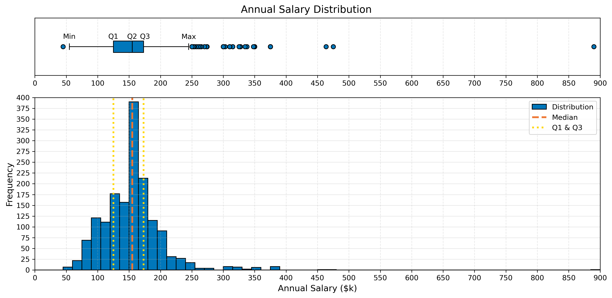

## [Salary Distribution](../4_senior_data_scientist/4_III_highest_paying/a_highest_paying_seniorDS_jobs/)

This documentation file focuses on three main tasks:
1. *Data cleaning* of the [result set](../4_senior_data_scientist/4_III_highest_paying/a_highest_paying_seniorDS_jobs/data/highest_paying_seniorDS_jobs.csv) of the following SQL script: [highest_paying_seniorDS_jobs.sql](../4_senior_data_scientist/4_III_highest_paying/a_highest_paying_seniorDS_jobs/scripts/highest_paying_seniorDS_jobs.sql)
2. *Building* the figure combining the histogram and the box plot of the cleaned salary distribution.
3. *Interpreting* the aforementioned figure.

Note that the main step of the cleaning process, which was the removal of duplicate rows, was also performed in the following SQL script: [ii_top_paying_skills_without_duplicates.sql](../4_senior_data_scientist/4_III_highest_paying/b_top_paying_skills/scripts/ii_top_paying_skills_without_duplicates.sql). The explanation of that script was provided here: [Q5.B. - II. Query 2](../docs/skills.md/#ii-query-2) 

### A. Data Cleaning
---
The [highest_paying_seniorDS_jobs.sql](../4_senior_data_scientist/4_III_highest_paying/a_highest_paying_seniorDS_jobs/scripts/highest_paying_seniorDS_jobs.sql) SQL script retrieves the job_title, job_location, job_schedule_type, job_work_from_home, company_name, and salary_year_avg columns of the highest_paying_jobs CTE. This CTE extracts job postings for Senior Data Scientist positions that include salary information. The [result set](../4_senior_data_scientist/4_III_highest_paying/a_highest_paying_seniorDS_jobs/data/highest_paying_seniorDS_jobs.csv) is ordered by the annual salary in descending order, and it also contains the names of the companies that offer the respective jobs.

### Q1. Why was data cleaning necessary?
---
This project started out as a SQL project solely. It became a SQL and Python project later on due to the need to create its visualizations. Because of that, the project doesn’t navigate the entire data science pipeline from start to finish. The original dataset came precleaned, and the objectives were to discover the most in-demand skills for data professionals by querying the database, and then, to visualize the results, and share the insights.

The duplicate rows were discovered at the end of the project while exploring the current dataset, before creating the box plot and histogram to analyze the salary distribution for the Senior Data Scientist role. The latter was not part of the original plan for the current project; however, it was integrated as a quick side project to uncover interesting information about the distribution of yearly salaries for the Senior Data Scientist role by examining the aforementioned result set.

### Q2. How was data cleaning conducted?
---
The Jupyter notebook where data cleaning occurs ([data_cleaning.ipynb](../4_senior_data_scientist/4_III_highest_paying/a_highest_paying_seniorDS_jobs/notebooks/data_cleaning.ipynb)), includes the following steps:
1. Initial Data Exploration:
    - ```info()```, which provides a concise summary of a DataFrame, reveals that the 'job_location' column has 25 null values (NaN) as the non-Null count of that column is 25 entries smaller than the total amount of entries (1686).
    - ```describe()```, which generates descriptive statistics of numerical columns, reveals that the mean and median of the salary distribution ('salary_year_avg') are almost equal, and that the IQR and standard deviation are almost equal as well.
2. Handling Missing Values:
    - Sets NaN to 'Unknown' to ensure that the NaN values in the 'job_location' column won't interfere with groupby operations, i.e., they won't be treated as unique values.
3. Identifying & Removing Duplicate Rows:
    - Uses ```duplicated()``` to find the duplicate rows in the 'salary_year_avg' column.
    - Multiple groupby operations reveal tha the duplicate rows are clustered around the median of the distribution.
    - Removes duplicate rows with ```drop_duplicates()```, keeping the first occurrence.
4. Validating Data Integrity:
    - Asserts all salaries are greater than zero.
5. Creating a Boolean Indicator Column:
    - Computes the median of the salary distribution.
    - Uses .loc to add a new column indicating whether the salary of each job posting is above or equal to the median (this column can be used to extract the highest-paying jobs).
6. Final Data Quality Check:
    - Uses ```info()```, ```describe()```, and ```isnull()``` to review the data quality of the cleaned DataFrame.
    - Documents changes by writing the cleaning steps to a log file.

### B. Building the Figure
---
After the data cleaning step, the 'salary_year_avg' column of the cleaned DataFrame (from cleaned_df.csv) serves as input in [diagrams.ipynb](../4_senior_data_scientist/4_III_highest_paying/a_highest_paying_seniorDS_jobs/notebooks/diagrams.ipynb) to produce the figures that describe the annual salary distribution for the Senior Data Scientist role. Before the visualizations are generated, basic descriptive statistics are calculated (quartiles, minimum and maximum of the box plot and of the distribution, mean, mode, IQR, range, skewness, and kurtosis).

The following table summarizes the features of the cleaned salary distribution:

| Salary Distribution Feature |  Value |
|:-----:|:-------:|
| Number of Entries | 1590 |
| Box Plot Minimum | 55,000 |
| Q1 = 25th Percentile | 125,000 |
| Q2 = 50th Percentile | 155,000 |
| Q3 = 75th Percentile | 173,000 |
| Box Plot Maximum | 245,000 |
| Mode | 157,500 |
| IQR   | 48,000   |
| Skewness | 3.1 |
| Kurtosis | 31.4 |

### I. Histogram
---
The construction of the histogram for the aforementioned distribution involves the following steps:
1. Defining the Bins:
    - Set the bin width to $15,000.
        - Note: Shrinking the bin width (e.g., width = 100) will result in a histogram containing the different modes that exist in the dataset.
    - Use ```np.arange()``` to generate salary bins with values starting at zero and extending up to, and including, the dataset maximum.
2. Creating the Histogram:
    - Use ```plt.hist()``` to create a histogram with the defined salary bins, black-edged bars, blue color, full opacity, and labeled as 'Distribution':
        - ```plt.hist(data, bins = salary_bins, edgecolor='black', color='#0077BB',alpha=1, label='Distribution')```
3. Customizing the Histogram:
    - Customize the plot's figure size, grid, title, and axes labels, ticks, and limits.
    - Add vertical lines for the median, Q1, and Q2 and include the legend.

### II. Box Plot
---
The construction of the box plot for the salary distribution involves the following steps:
1. Creating the Box Plot:
    - Use ```plt.boxplot()``` to create a box plot with horizontal orientation, set the box height, and style the box face color, median line, and outlier markers.
```python
plt.boxplot(data,
            vert=False, # Horizontal orientation 
            widths=0.2, # Sets the height of the box (width for horizontal box plots)
            patch_artist=True, # Enables filling the box with color
            boxprops=dict(facecolor='#0077BB',alpha=1), # Box appearance
            medianprops=dict(color='black'), # Black median line
            flierprops=dict(marker='o', markerfacecolor='#0077BB',alpha=1) # Outlier style
            )
```
2. Customizing the Box Plot:
    - Customize the plot by setting the figure size, title, x-axis label, ticks, and limit and by removing the y-axis tick mark and label ('1').

### III. Combined Figure
---
Combining the box plot and the histogram of the salary distribution into a single figure, involves the following steps:
1. Creating the Figure & Axes Objects:
    - Use ```plt.subplots()``` to create a figure with 2 rows (2 subplots) and 1 column, and set the figure size and height ratios.
        - ```fig, (ax1, ax2) = plt.subplots(2, 1, figsize=(12, 6), height_ratios=[1, 3])```
2. Creating the Box Plot:
    - In the same manner as before, but with the following differences:
        - Use ```ax1.``` instead of ```plt.``` (e.g., ax1.boxplot(..) instead of plt.boxplot(...)).
        - Add text labels for the quartiles, and the minimum and maximum of the box plot.  
3. Creating the Histogram:
    - In the same manner as before, but with the following differences:
        - Use ```ax2.``` instead of ```plt.``` (e.g., ax2.hist(..) instead of plt.hist(...))
        - Align the x-axes of both subplots (ax1.set_xlim(ax2.get_xlim()))

The combined figure is displayed below:



### C. Interpretation
---

### I. Center & Spread
---
The histogram of the figure reveals a *unimodal* distribution of annual salaries where the highest frequency occurs at $157,500 (*mode* of the distribution). 

To begin with, the *median* of the distribution is located at $155,000. Since the median represents the 50th percentile, this means that 50% of employees (Senior Data Scientists) in the distribution earn less than $155,000 per year (and subsequently the other half of the salaries in the distribution are above that value).

Then, the first quartile, *Q1*, representing the 25th percentile, is positioned at $125,000, while the third quartile, *Q3*, representing the 75th percentile, is situated at $173,000.

After that, the interquartile range, *IQR*, which is defined as the difference between Q3 and Q1, describes the spread of the central portion of the dataset and thus, is *a measure of variability around the median* (Q2). IQR is equal to $48,000, which is approximately equal to ⅓ of the median, suggesting a wide spread around the latter, and it also has a value that is similar to the standard deviation (std = $51,000).

Except that, the minimum and maximum of the *box plot*, which are depicted as the left and right ends of the whiskers, are placed at $55,000 and $245,000 respectively.

Moreover, the range of the dataset, that is, the spread of all data points in the distribution or the difference between the maximum and minimum values that appear in the dataset, is substantially larger than the IQR (Range = $845,000), *indicating significant outliers among higher salaries*.This also becomes apparent by looking at the box plot of the figure.

Finally, the three average types of this distribution are almost equal to each other (mean = $153,653, median = $155,000, mode = $157,500).

Considering the aforementioned values and concepts, it is crucial to emphasize a key feature and propose a significant suggestion. 
- First, regarding the feature, the distribution exhibits two characteristics that are *features of a normal distribution*, namely the equal average types and similar IQR and standard deviation. Hence, the unimodal analysis yields a distribution that is almost symmetrical in the central part of the distribution.
- Second, regarding the suggestion, it would be advisable to strive to secure a salary that is at least above the median and ideally, between the 75th percentile and the maximum value of the box plot (**between $173,000 and $245,000**), in order to become a high-income earner or to even be able to become an outlier later on.

### II. Shape
---
Concerning the shape of the distribution, there are two features that need to be addressed.

First, regarding the **skewness** of the distribution, it measures both the **direction** and the **degree of asymmetry** of the distribution in relation to its central value, thus indicating **where the outliers are located**, if any exist. Here, skewness is equal to 3.1, revealing that the distribution is highly positively skewed or right-skewed. In this case, the distribution is asymmetrical and while the majority of salaries are clustered around the median, there is a *long right tail of higher salaries*. In highly-skewed distributions the mean is largely influenced by outliers and hence, most of the time the median is used (instead of the mean) as a central tendency measure, because the presence of extreme values does not affect it as much.

Second, with respect to the **kurtosis** of the distribution, it quantifies both the **presence** and the **impact** the outliers have on the shape of the distribution, thus showing whether extreme values are responsible for the variability in the dataset, if any exist. Here, (Fisher) kurtosis is equal to 31.4, exposing that the distribution is extremely leptokurtic. In this case, the distribution is characterized by a heavy right-tail and a sharper peak compared to a normal distribution, suggesting that many outliers are present and have a *substantial impact* on the shape of the distribution.

Given the previously discussed values and concepts, it is vital to emphasize a key feature and propose a significant suggestion.
- First, regarding the feature, the distribution exhibits two characteristics that are *features of a log-normal distribution*, namely the high degree of both skewness and kurtosis. Hence, even though the distribution demonstrates **normal distribution characteristics around the median**, it exhibits **log-normal distribution characteristics at higher salaries** due to the presence of outliers. 
- Second, regarding the suggestion, these log-normal features illustrate that there is great variability at the higher end of the salary distribution and subsequently that, while most Senior Data Scientists earn within a typical range, there are *a few individuals that earn significantly higher salaries* compared to the majority. The former is crucial to understand, as it highlights the **potential for high earnings in the field**. 
    - In order to discover why some professionals earn disproportionately more, one should analyze the outliers of the distribution separately, so that the respective trends leading to higher compensation can emerge. Unfortunately, this is out of the scope of the project. However, one could make a first logical hypothesis based on the fact that companies are only willing to pay premium rates when the individuals can provide value that is commensurate with that premium pay. That could mean many different things, such as the acquisition of specialized skills and the acceptance of different kinds of roles, for example leadership roles, roles that pay well but occur in remote regions, or simply roles in high-paying industries.