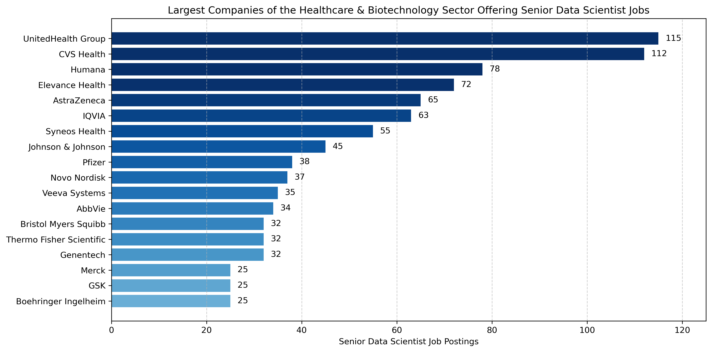

## [Sectors](../4_senior_data_scientist/4_II_companies_most_jobs/)

<u>Main Question</u>: Which industry **sectors** offer the **most** Senior Data Scientist **jobs**, and what are some examples of **companies** in these sectors?

### A. Extracting the Companies that Offer the Most Senior Data Scientist Jobs
---
The first SQL script of this subproject retrieves the companies that offer the most Senior Data Scientist jobs. To accomplish that, an inner join is used to access the names of the companies that offer at least one job. After that, filtering occurs to extract solely the Senior Data Scientist jobs. Then, the results are grouped by the company name to aggregate the job postings, excluding any companies that offer fewer than 25 Senior Data Scientist positions. Finally, the script retrieves the count of job postings for each qualifying company and orders the output in descending order based on that count.

[a_companies_most_jobs.sql](../4_senior_data_scientist/4_II_companies_most_jobs/scripts/a_companies_most_jobs.sql)

### B. Industry Sectors
---

### I. Query
---
The second SQL script ([b_sectors.sql](../4_senior_data_scientist/4_II_companies_most_jobs/scripts/b_sectors.sql)) employs the CASE expression to categorize the aforementioned companies into different industry sectors based on their principal business activities. 

To accomplish that, the SQL query of the previous script is used as a CTE (named 'companies') to get the names of the companies that offer at least 25 Senior Data Scientist positions. Also, an additional filtering criterion is added to the same CTE so that job openings that do not mention the company name are excluded from the result set of that CTE: 
```sql
WHERE cmp.name NOT IN ('Confidenziale', 'Confidential','Confidencial')
```
Then, a second CTE (named 'sectors') is written to create the column that will hold the names of the sectors, and thus to categorize the companies into those sectors. This CTE includes:
- A window function that calculates the total number of job openings:
```sql
SELECT SUM(senior_DS_companies) OVER () AS total_count_having25
```
- A CASE expression to categorize the different companies to their respective sectors:
```sql
CASE
    WHEN company_name IN ('Walmart', 'Target', 'Amazon', 'Walgreens','Sam''s Club','Etsy', 'WALGREENS', 
                          'Shopify', 'The Home Depot','Vinted','84.51°') THEN 'Retail'
…
ELSE 'Other'
END AS sector_name
```

The main query utilizes the second CTE, groups its result set by the sector name, and retrieves each sector along with its market share for the Senior Data Scientist role. Here, 'market share' is defined as the total number of jobs offered by companies within the same sector divided by the total number of jobs offered by all companies that offer at least 25 Senior Data Scientist positions.
```sql
SELECT ROUND( (( SUM(senior_DS_companies) / total_count_having25 ) * 100.0) , 1 ) AS market_share
```

### II. Notebook
---
In the same manner as before, the following Jupyter notebook reads the [b_sectors.csv](../4_senior_data_scientist/4_II_companies_most_jobs/data/b_sectors.csv) file and creates a horizontal bar chart where the names of the sectors are on the y axis and the market share of each sector is on the x axis: [sectors.ipynb](../4_senior_data_scientist/4_II_companies_most_jobs/notebooks/sectors.ipynb)

The resulting horizontal bar chart is provided below:


<br>

The chart clearly shows that the Recruitment industry is the dominant sector offering the most Senior Data Scientist jobs, followed by the Banking & Financial Services sector. Besides these, the Consulting, Healthcare & Biotechnology, Technology, and Retail sectors also offer many such positions.

### C. Top 5 Companies of the Top 6 Sectors
---
The SQL script of this subtask ([c_largest_companies_largest_sectors.sql](../4_senior_data_scientist/4_II_companies_most_jobs/scripts/c_largest_companies_largest_sectors.sql)) uses both the CTEs (companies & sectors) from the previous script ([b_sectors.sql](../4_senior_data_scientist/4_II_companies_most_jobs/scripts/b_sectors.sql)), but not its main query, in order to retrieve the top 5 companies of the top 6 sectors.

The retrieval proceeds as follows:
- One SELECT statement is written for each sector (``` WHERE sector_name = 'name' ```)
- Each SELECT statement is enclosed in parentheses so that the ORDER BY & LIMIT clauses can be applied to each statement.
    - The ORDER BY clause sorts the results in descending order by the total number of Senior Data Scientist job postings each company offers (senior_DS_companies).
    - The LIMIT clause (```LIMIT 5```) retrieves the top 5 companies of each sector. 
- Finally,  the ```UNION``` operator combines the result sets into a single result set.

<br>

The following tables present the top 5 companies of the top 6 industry sectors that were analyzed:

| **Recruitment**               |               | **Banking & Financial Services** |               |
|:-----------------------------:|:-------------:|:---------------------------------:|:-------------:|
| **Company Name**              | **Number of Jobs** | **Company Name**                 | **Number of Jobs** |
| Harnham                       | 375           | Wells Fargo                      | 155           |
| Emprego                       | 311           | Visa                             | 152           |
| Michael Page                  | 89            | Citi                             | 121           |
| Jobot                         | 65            | Fidelity Investments             | 92            |
| Vesterling AG                 | 57            | Airwallex                        | 53            |

| **Healthcare & Biotechnology** |               | **Consulting**                |               |
|:-------------------------------:|:-------------:|:-----------------------------:|:-------------:|
| **Company Name**               | **Number of Jobs** | **Company Name**              | **Number of Jobs** |
| UnitedHealth Group             | 115           | Booz Allen Hamilton           | 304           |
| CVS Health                     | 112           | Guidehouse                    | 180           |
| Humana                         | 78            | Deloitte                      | 123           |
| Elevance Health                | 72            | Capgemini                     | 68            |
| AstraZeneca                    | 65            | EY                            | 67            |

| **Technology**                |               | **Retail**                    |               |
|:-----------------------------:|:-------------:|:-----------------------------:|:-------------:|
| **Company Name**              | **Number of Jobs** | **Company Name**              | **Number of Jobs** |
| Oracle                        | 83            | Walmart                       | 391           |
| Dice                          | 72            | Amazon                        | 94            |
| EPAM Systems                  | 69            | Walgreens                     | 90            |
| BairesDev                     | 61            | Target                        | 81            |
| Microsoft                     | 57            | Etsy                          | 54            |

It is apparent that the results are skewed towards **large corporations** with established Data Science teams, as they typically have higher demand for experienced professionals.

### D. Healthcare & Biotechnology Sector
---

### I. Query
---
The SQL script of this final subtask ([d_healthcare_biotechnology_sector.sql](../4_senior_data_scientist/4_II_companies_most_jobs/scripts/d_healthcare_biotechnology_sector.sql)) uses both the CTEs (companies & sectors) from the second SQL script ([b_sectors.sql](../4_senior_data_scientist/4_II_companies_most_jobs/scripts/b_sectors.sql)), but not its main query, in order to retrieve only the companies of the 'Healthcare & Biotechnology' sector. To accomplish this, the script integrates the SELECT statement for the 'Healthcare & Biotechnology' sector from [c_largest_companies_largest_sectors.sql](../4_senior_data_scientist/4_II_companies_most_jobs/scripts/c_largest_companies_largest_sectors.sql), which:
- Extracts only the companies of the respective sector and
- Sorts the results in descending order by the total number of Senior Data Scientist job postings each company offers (senior_DS_companies).

### II. Notebook
---
In the same manner as before, the following Jupyter notebook reads the [d_healthcare_biotechnology_sector.csv](../4_senior_data_scientist/4_II_companies_most_jobs/data/d_healthcare_biotechnology_sector.csv) file, removes duplicates from the DataFrame, and creates a horizontal bar chart where the names of the companies are on the y axis and the count of Senior Data Scientist positions for each company is on the x axis: [healthcare_biotechnology_sector.ipynb](../4_senior_data_scientist/4_II_companies_most_jobs/notebooks/healthcare_biotechnology_sector.ipynb)
- Removing the Duplicate Rows from the DataFrame:
    - Create a list containing the company names that appear twice on the file.
    - Create a Boolean mask to remove the duplicates
```python
mask = ~df['company_name'].isin(companies_to_remove)
cleaned_df = df[mask] # Create a new DataFrame without the specified companies
```

<br>

The resulting horizontal bar chart is provided below:



<br>

The chart clearly demonstrates that the 'Healthcare Providers and Payers' subsector is the dominant subsector offering the most Senior Data Scientist jobs ( top 4 companies (!) ), followed by the 'Contract Research and Services' and 'Pharmaceuticals' subsectors in that order.
- Companies of the 'Healthcare Providers and Payers' Subsector: UnitedHealth Group, CVS Health, Humana, and Elevance Health.
- Companies of the 'Contract Research and Services' Subsector: IQVIA and Syneos Health
- Companies of the 'Pharmaceuticals' Subsector: AstraZeneca, Johnson & Johnson, Pfizer, Novo Nordisk, AbbVie, Bristol Myers Squibb, Genentech, Merck, GSK, and Boehringer Ingelheim.
- Other Subsectors:
    - 'Medical Devices and Diagnostics' Subsector: Thermo Fisher Scientific
    - 'Health Technology' Subsector: Veeva Systems 