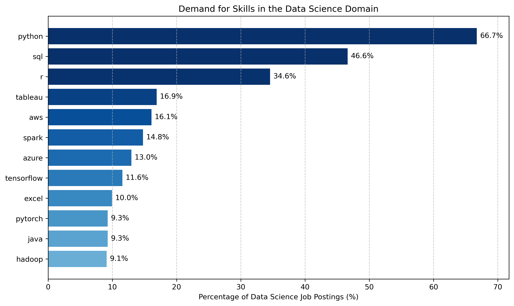

## [Overlapping Skills](../1_overlapping_skills/)

### Q1. What are the most in-demand overlapping skills from all three data-related domains?

### I. Query
---
The following SQL script **identifies** the most in-demand skills that overlap across all three data-related domains by creating a different Common Table Expression (CTE) for each domain to calculate skill counts (= number of times a particular skill appears in the respective dataset of job postings), then joining the three CTEs to highlight the shared high-demand skills:

[1_overlapping_skills.sql](../1_overlapping_skills/1_overlapping_skills.sql)

### II. Notebook
---
The following Python script reads the CSV file containing the skill counts of the previous query, calculates the percentage representation of each skill based on the total number of job postings, and **generates** both a horizontal **bar chart** displaying overall skill demand percentages and a stacked bar chart illustrating the distribution of skill demand across the different data-related domains:

[overlapping_skills_bar_charts.ipynb](../1_overlapping_skills/overlapping_skills_bar_charts.ipynb)

### III. Interpretation
---
<u>Horizontal Bar Chart</u>:


<br>

The bar chart shows the 7 most in-demand overlapping skills as a percentage of the total number of job postings.

Two skills dominate the figure by a significant margin, namely SQL and Python, each appearing in approximately 50% of all job postings.
- **SQL** is a standardized programming language designed for communicating with relational databases.
    - Key concepts beginners can focus on:
        - Basic SQL Commands and Functions
        - Joins
        - Case Expression
        - CTEs
- **Python** is a versatile high-level programming language. In the context of data science, it is used extensively throughout the entire data lifecycle, for example for performing tasks such as data collection, preparation, analysis, and visualization or for building machine learning models.
    - Key concepts beginners can focus on:
        - Python Basics (Basic syntax elements and data types, control flow, and functions)
        - Libraries (NumPy, Pandas, and Matplotlib)

<u>Stacked Bar Chart</u>:


<br>

The stacked bar chart extends the functionality of the previous bar chart by displaying the distribution of skill counts across the different domains.

Its inclusion here serves the purpose of explaining why the other skills shown in the bar chart are not included in the list of chosen overlapping skills. 
The reason for that is twofold: 
- First, their percentage is significantly smaller than the percentages of SQL & Python.
- Second, in most cases there is a large difference between the counts of those skills in the different data-related domains. For example: 
    - AWS and Azure are prevalent in data engineering roles, 
    - R is predominantly sought in the data science domain, and 
    - Excel is mostly required in data analytics positions.

<u>Important Note</u>:

The most observant of you will have noticed that the first level of the [pyramid](../Pyramid_Chart.png) also included the following skills: GenAI, Git, MS Office, and Linux. These complementary skills are **not** part of the previous analysis. However, it is strongly advised to have a basic understanding of them.

These tools appear in a limited number of job postings and they are never present at an overwhelming percentage (except Excel specifically in the domain of Data Analytics, while GenAI is not present at all). 
- For example, in the full version (Limit 7; removed or commented - [overlapping_skills.csv](../1_overlapping_skills/data/overlapping_skills.csv)) of the CSV file that was read to produce the preceding figures, the skills Git, MS Office, and Linux appeared in the following places:
    - Git - 17th
    - MS Office: Excel - 6th, Word - 30th, & Powerpoint - 32nd 
    - Linux - 36th
- Why?
    - First, tools such as Git, Linux, and MS Office are generally viewed as assumed knowledge within the IT industry.
    - Second, other skills such as programming languages are often prioritized instead of the aforementioned complementary skills, as the latter are not considered central to the job’s core responsibilities.
    - In particular, GenAI is not part of the list of skills that was used to extract the skill keywords from job postings, mainly because the first chatbots were introduced at the same period the collection of Luke Barousse’s data for this dataset occurred. Hence, GenAI was not a known skill to be included in job postings at that time.

Brief Description of Each Skill:
- GenAI
    - GenAI is an exceptionally versatile tool that can be applied throughout a data professional's career. It assists in various tasks, including identifying and resolving bugs, enhancing data preparation and analysis, automating reports and supporting data modeling and optimization.
- Git
    - Git is a collaboration and version control tool that allows users to track changes in their code while facilitating effective teamwork.
- Linux
    - First, Linux is the industry standard for servers and many data science projects are based on it.
    - Second, scripting tools like Bash, AWK, and SED can be utilized for the automation of data management tasks, greatly enhancing one’s productivity. 
    - Finally, when it comes to data, security is always a concern, and Linux generally provides a more secure environment than other operating systems.
- MS Office
    - The tools of the MS Office suite, namely Excel, Word, and PowerPoint, are relevant for performing basic data analysis, creating reports, and presenting findings respectively.

<br>

<u>Summary of the Chosen Overlapping & Complementary Skills</u>:

| Overlapping Skill  | Short Description                                                                 |
|:------:|:---------------------------------------------------------------------------------:|
|  SQL   | Standardized programming language designed for communicating with relational databases |
| Python | High-level programming language (data collection, preparation, analysis, and visualization) |

| Complementary Skill   |                           Short Description                            |
|:---------:|:---------------------------------------------------------------------|
|   GenAI   | Generative AI (AI that can produce content based on the prompts of the user) |
|    Git    | Collaboration and Version Control Tool                                 |
| Linux/Bash | Operating System/Scripting Tool                                        |
| MS Office | Excel, Word, and PowerPoint                                           |


## [Data Science Skills](../2_data_science_domain/)

### Q2. What are the most in-demand skills in the Data Science domain?

### I. Query
---
To identify the most in-demand skills for the Data Science domain, the **Data Science CTE** of the SQL script previously used to identify overlapping skills across all three domains ([1_overlapping_skills.sql](../1_overlapping_skills/1_overlapping_skills.sql) - 2nd CTE) was adapted to exclude all the skills the person will have learned by the time this step is reached (in order to move on from the *first* to the *second* level of the [pyramid](../Pyramid_Chart.png)):
- `WHERE skill_name NOT IN ('sql','python')`

[2_data_science_domain.sql](../2_data_science_domain/2_data_science_domain.sql)

### II. Notebook
---

In the same manner, the following script was adapted from the respective Jupyter Notebook of the previous question ([overlapping_skills_bar_charts.ipynb](../1_overlapping_skills/overlapping_skills_bar_charts.ipynb)) to generate the visualizations of the Data Science domain solely by changing three things:
- The CSV files read now refer solely to the Data Science domain.
- The new job postings pool (= total number of job openings for this domain) is equal to 209,802 for the Data Science domain.
- Only horizontal bar charts are present (not stacked bar charts), because the files read refer solely to the Data Science domain (rather than to all three domains). The former will hold true for all other levels of the [pyramid](../Pyramid_Chart.png), because each one of them will refer to a specific domain.

<u>Note that</u>:
- The phrase "**Unaddressed** Skills" refers to skills that the person *hasn't already learned*, and which are *dissimilar* to other skills that the person has already learned.

[data_science_skills_bar_charts.ipynb](../2_data_science_domain/data_science_skills_bar_charts.ipynb)

### III. Interpretation
---
<u>Bar chart - All Skills</u>:



<br>

The bar chart shows the top 12 most in-demand skills for the Data Science Domain as a percentage of the total number of job postings referring to the same domain.

Once again, Python & SQL occupy the top positions, appearing in 66.7% and 46.6% of all Data Science job postings. As these two skills were addressed in the first level of the [pyramid](../Pyramid_Chart.png), they are excluded from the analysis of the current level. The figure that only illustrates the top 10 *unaddressed* skills for this level is given below (same figure, but without Python & SQL):

<u>Bar chart - Unaddressed Skills</u>:


<br>

Excluding Excel, which has been mentioned as a complementary skill, and Java & Hadoop both of which have a percentage that is smaller than 10% of the Data Science job postings pool and which are dissimilar to other skills, the rest of the unaddressed skills are listed in the table below:

| Unaddressed Skill   | Data Science Skill Count | Percentage of Data Science Job Postings (%) | Short Description          |
|:-------------:|:-----------------------:|:-------------------------------------------:|:---------------------------|
| R            |          72526         |                     34.6                    | Statistical programming language |
| Tableau      |          35472         |                     16.9                    | Data Visualization Tool     |
| AWS          |          33779         |                     16.1                    | Cloud Platform              |
| Spark        |          30991         |                     14.8                    | Big Data Framework          |
| Azure        |          27227         |                     13.0                    | Cloud Platform             |
| TensorFlow   |          24261         |                     11.6                    | Deep Learning Framework     |
| PyTorch      |          19461         |                     9.3                     | Deep Learning Framework     |

To begin with, R, Tableau, and Spark are all skills that haven't been previously addressed, and which are dissimilar to other skills in the table. Hence, they are definitely selected.

Regarding AWS and Azure, they are *alternative* cloud platforms with distinct ecosystems, thus, in reality, most people will choose to learn one or the other rather than both. Hence, AWS is chosen here, due to its market dominance compared to Azure.

In contrast, PyTorch and TensorFlow are *complementary* machine learning skills, because they both focus on deep learning frameworks with overlapping yet distinct strengths, making it beneficial to learn them in tandem for a well-rounded understanding.

Considering the above, the following table shows the curated list of the chosen skills for the **Data Science** domain: 

| Chosen Skill           | Short Description                     |
|:---------------------|:-------------------------------------|
| R                    | Statistical programming language      |
| Tableau              | Data Visualization Tool              |
| AWS           | Cloud Platforms                      |
| Spark                | Big Data Framework                   |
| TensorFlow & PyTorch | Deep Learning Frameworks             |

## [Data Engineering Skills](../3_data_engineering_domain/)

### Q3. What are the most in-demand skills in the Data Engineering domain?

### I. Query
---
To identify the most in-demand skills for the Data Engineering domain, the **Data Engineering CTE** of the SQL script previously used to identify overlapping skills across all three domains ([1_overlapping_skills.sql](../1_overlapping_skills/1_overlapping_skills.sql) - 2nd CTE) was adapted to exclude all the skills the person will have learned by following the **two previous steps** (in order to move on from the *second* to the *third* level of the [pyramid](../Pyramid_Chart.png)):
- `WHERE skill_name NOT IN ('sql','python','r', 'tableau', 'aws', 'spark', 'azure', 'tensorflow','pytorch')`

[3_data_engineering_domain.sql](../3_data_engineering_domain/3_data_engineering_domain.sql)

### II. Notebook

In the same manner, the following script was adapted from the respective Jupyter Notebook of the previous question ([/data_science_skills_bar_charts.ipynb](../2_data_science_domain/data_science_skills_bar_charts.ipynb)) to generate the visualizations of the Data Engineering domain solely by changing the CSV files read, the job postings pool (231,371 for this domain), and the respective texts making up the figure.

[data_engineering_skills_bar_charts.ipynb](../3_data_engineering_domain/data_engineering_skills_bar_charts.ipynb)

### III. Interpretation
---
<u>Bar chart - All Skills</u>:


<br>

The bar chart shows the top 10 most in-demand skills for the Data Engineering domain as a percentage of the total number of job postings referring to the same domain.

Once again, Python & SQL occupy the top positions, both appearing in approximately 60% of all Data Engineering job postings. Besides that, AWS, Azure, and Spark appear as well, and all of them have percentages that are greater than or equal to 30% of the total Data Engineering job postings pool. All the aforementioned skills and every other skill that was addressed in the two previous levels of the [pyramid](../Pyramid_Chart.png) ([WHERE Clause](#i-query-2)) are excluded from the analysis of the current level. The figure that only illustrates the top 10 *unaddressed* skills for this level is given below:

<u>Bar chart - Unaddressed Skills</u>:


<br>

All the unaddressed skills for this domain alongside with their counts, percentages, and short descriptions are listed in the table below: 

| Unaddressed Skill   | Data Engineering Skill Count | Percentage of Data Engineering Job Postings (%) | Short Description                                                                 |
|:-------------:|:----------------------------:|:------------------------------------------------:|:----------------------------------------------------------------------------------|
| Java       | 45814                        |   19.8                                            | General-purpose programming language used for building scalable applications and processing large datasets.                  |
| Kafka      | 38890                        |   16.8                                            |  Distributed event streaming platform used for building real-time data pipelines and streaming applications.                 |
| Scala        |            37453            |                       16.2                       | High-level programming language used with Apache Spark for big data processing.   |
| Hadoop     | 36762                        | 15.9                                               | Open-source framework for distributed storage and processing of large datasets.                   |
| Snowflake  | 35821                        |     15.5                                          | Cloud-based data warehousing platform designed for scalable storage, processing, and analytic solutions.                  |
| Databricks   |            35353            |                       15.3                       | Cloud-based data engineering platform built on Apache Spark.                      |
| Airflow      |            34279            |                       14.8                       | Workflow automation tool designed for managing complex data pipelines.            |
| NoSQL        |            29000            |                       12.5                       | Category of database management systems that are designed for managing unstructured or semi-structured data (MongoDB/Cassandra). |
| GCP        | 28550                        |    12.3                                           | The Google Cloud Platform offering data storage, processing, and analytics services for scalable data engineering solutions.                  |
| Redshift   | 24807                        |    10.7                                           | Amazon's fully managed cloud data warehouse service designed for large-scale data storage and fast query performance.                   |

<br>

The demand for most skills is comparable, so additional criteria are needed to make a decision about which skills to select.

To begin with, Scala will be selected instead of Java for its functional programming capabilities and its compatibility with Spark for big data processing, so that the person can build upon the skills they will already have learned (Spark was one of the chosen skills of the previous level). In other words, at this stage it would be better to complement the skills they already know instead of learning a new language and then also having to learn Hadoop in order to do big data processing (because Hadoop is based on Java). Since Java is not selected and Hadoop is built primarily using Java, Hadoop is also not selected at this stage.

After that, Databricks will be selected over Snowflake, because of the advanced data engineering and machine learning capabilities of the former. These platforms are both cloud-based and proprietary, and they are often viewed as alternative platforms serving different purposes. On the one hand, Databricks is a unified analytics platform that focuses heavily on big data processing, data engineering, and machine learning workloads. On the other hand, Snowflake is mainly a data warehouse used for SQL-based analytics and business intelligence workloads. In reality, both platforms can be used, Databricks for ETL (Extract, Transform, Load) and ML operations and Snowflake for efficient data warehousing, but this goes beyond the scope of this project (Databricks comes with data warehousing capabilities through Databricks SQL and its lakehouse architecture, thus Databricks alone could suffice). Finally, since Redshift is a cloud-based data warehouse like Snowflake, it is also not selected.

Besides that, GCP (Google Cloud Platform) is also not chosen, because it is an alternative to AWS, which was one of the chosen skills of the previous level.

Moreover, Airflow is chosen instead of Kafka, because Airflow handles batch workflows, which are generally easier to implemenet and manage than real-time streams (handled by Kafka). In reality, both tools can be used (batch vs real-time workflows), but, since the person wants to learn the basic data engineering skills, Airflow is selected for simplicity here.

Lastly, since NoSQL is dissimilar to any other unaddressed skill, it is definitely chosen. NoSQL refers to a category of database management systems that are designed to handle unstructured and semi-structured data. Two of the most common NoSQL database management systems are MongoDB and Cassandra. On the one hand, MongoDB (19th place in [data_engineering_skills.csv](../3_data_engineering_domain/data/data_engineering_skills.csv)) is a document-oriented NoSQL database that stores data in JSON-like documents. On the other hand, Cassandra (38th place in [data_engineering_skills.csv](../3_data_engineering_domain/data/data_engineering_skills.csv)) is a wide-column store NoSQL database, designed for handling large amounts of data across many servers with high availability.

Considering the above, the following table shows the curated list of the chosen skills for the **Data Engineering** domain:

| Chosen Skill           | Short Description                     |
|:-------------:|:----------------------------------------------------------------------------------|
| Scala        | High-level programming language used with Apache Spark for big data processing.   |
| Databricks   | Cloud-based data engineering platform built on Apache Spark.                      |
| Airflow      | Workflow automation tool designed for managing complex data pipelines.            |
| NoSQL        | Category of database management systems that are designed for managing unstructured or semi-structured data (MongoDB/Cassandra). |


## [Senior Data Scientist Skills](../4_senior_data_scientist/4_I_most_in_demand_skills/)

### Q4. What are the most in-demand skills for the Senior Data Scientist role?

### I. Query
---
To identify the most in-demand skills for the Senior Data Scientist role, the SQL script previously used to identify the most in-demand skills for the *entire Data Science domain* ([2_data_science_domain.sql](../2_data_science_domain/2_data_science_domain.sql)) was adapted to both include solely the Senior Data Scientist role and exclude all the skills the person will have learned by following the **three** previous steps (in order to move on from the *third* to the *fourth* level of the [pyramid](../Pyramid_Chart.png)):
```sql
WHERE
    jpf.job_title_short = 'Senior Data Scientist' AND
    skills.skills NOT IN ('sql','python',
    'r', 'tableau', 'aws', 'spark', 'azure', 'tensorflow','pytorch',
    'scala','databricks','airflow','nosql','mongodb','cassandra', 'gcp','redshift')
```

[4_I_most_in_demand_skills.sql](../4_senior_data_scientist/4_I_most_in_demand_skills/4_I_most_in_demand_skills.sql)

### II. Notebook
---

In the same manner, the following script was adapted from the respective Jupyter Notebook of question Q2 ([/data_science_skills_bar_charts.ipynb](../2_data_science_domain/data_science_skills_bar_charts.ipynb)) to generate the visualizations solely for the Senior Data Scientist role by changing the CSV files read, the job postings pool (37,076 for this role), and the respective texts making up the figure.

[senior_DS_skills_bar_charts.ipynb](../4_senior_data_scientist/4_I_most_in_demand_skills/senior_DS_skills_bar_charts.ipynb)

### III. Interpretation
---

<u>Bar chart - All Skills</u>:


<br>

The bar chart shows the top 10 most in-demand skills for the Senior Data Scientist role as a percentage of the total number of job postings referring to the same role.

The analysis shows that the most in-demand skills for the Senior Data Scientist role are the same as the most in-demand skills for the entire Data Science domain: Python, SQL , R, AWS/Azure, Spark, Tensorflow/Pytorch, Tableau. Hence, the current analysis will focus on niche skills for this particular role.

The figure that only illustrates the top 10 *unaddressed* skills for this level is given below:

<u>Bar chart - Unaddressed Skills</u>:


<br>

First, Pandas, NumPy, and Scikit-learn are all skills the person will already have learned by learning Python for Data Science (level 1 of the [pyramid](../Pyramid_Chart.png)) and Machine Learning with Python (TensorFlow & PyTorch - Level 2 of the pyramid). Hence, they are filtered out.

Second, both Excel and Git have already been addressed as complementary skills (level 1).

Third, Power BI, which is a data visualization tool, is an alternative to Tableau, which has also been addressed (level 2).

Fourth, Go, a programming language, holds the smallest percentage of all the skills in the previous diagram and thus, will be excluded from the list of recommended skills of this level.

Fifth, Java and Hadoop will both be selected here. On the one hand, Java is a general-purpose programming language used in Data Science for building scalable applications. It is often utilized in big data technologies like Hadoop for processing large datasets. On the other hand, Hadoop, which is built primarily using Java, is an open-source framework for distributed storage and processing of large datasets (HDFS for storing and MapReduce for processing large datasets). It supports various languages through APIs (e.g., Python, R, Scala), and it is the host of many many big data processing frameworks, such as Pig, Hive, Giraph, Storm, Flink, and HBase. Spark is also a part of the Hadoop Ecosystem, and it is mainly used for fast data processing and in-memory computations, whereas Hadoop is generally slower due to its reliance on disk-based storage.

Finally, SAS (Statistical Analysis System) is a comprehensive statistical software suite used for advanced data analytics. It will be included in the selected skills for this level; however, there is a condition to that. By this stage, the person will already have learned R, thus from a skills perspective there is no need to cover SAS, since they are alternative tools.R, on the one hand, is an open source programming language that is mainly used in academia and data science for statistical analysis, data visualization, and machine learning tasks. SAS, on the other hand, is a proprietary tool primarily used in enterprise and regulated settings (e.g., healthcare and finance industries) for statistical data analysis. Hence, when the person reaches this point on their journey, they are advised to include SAS only if their work environment is part of enterprise or regulated settings. 

Considering the above, the following table shows the curated list of the chosen skills for the **Senior Data Scientist role**:

| Chosen Skill   | Short Description                                                                 |
|:-------------:|:----------------------------------------------------------------------------------|
| SAS          | Statistical Software Suite                                                          |
| Hadoop       | Big data framework designed for distributed storage and processing of data.       |
| Java         | High-level programming language designed for building high performance systems. |

## [Top-Paying Skills for the Senior Data Scientist Role](../4_senior_data_scientist/4_III_highest_paying/)

