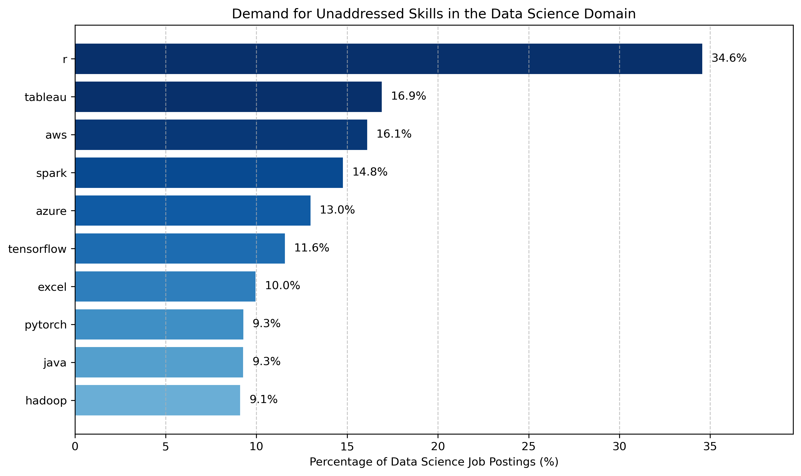

## [Overlapping Skills](../1_overlapping_skills/)

### Q1. What are the most in-demand overlapping skills from all three data-related domains?

### I. Query
---
The following SQL script **identifies** the most in-demand skills that overlap across all three data-related domains by creating a different Common Table Expression (CTE) for each domain to calculate skill counts (= number of times a particular skill appears in the respective dataset of job postings), then joining the three CTEs to highlight the shared high-demand skills:

[1_overlapping_skills.sql](../1_overlapping_skills/1_overlapping_skills.sql)

### II. Notebook
---
The following Python script reads the CSV file containing the skill counts of the previous query, calculates the percentage representation of each skill based on the total number of job postings, and **generates** both a horizontal **bar chart** displaying overall skill demand percentages and a stacked bar chart illustrating the distribution of skill demand across the different data-related domains:

[overlapping_skills_bar_charts.ipynb](../1_overlapping_skills/overlapping_skills_bar_charts.ipynb)

### III. Interpretation
---
<u>Horizontal Bar Chart</u>:

 

The bar chart shows the 7 most in-demand overlapping skills as a percentage of the total number of job postings.

Two skills dominate the figure by a significant margin, namely SQL and Python, each appearing in approximately 50% of all job postings.
- **SQL** is a standardized programming language designed for communicating with relational databases.
    - Key concepts beginners can focus on:
        - Basic SQL Commands and Functions
        - Joins
        - Case Expression
        - CTEs
- **Python** is a versatile high-level programming language. In the context of data science, it is used extensively throughout the entire data lifecycle, for example for performing tasks such as data collection, preparation, analysis, and visualization or for building machine learning models.
    - Key concepts beginners can focus on:
        - Python Basics (Basic syntax elements and data types, control flow, and functions)
        - Libraries (NumPy, Pandas, and Matplotlib)

<u>Stacked Bar Chart</u>:

 

The stacked bar chart extends the functionality of the previous bar chart by displaying the distribution of skill counts across the different domains.

Its inclusion here serves the purpose of explaining why the other skills shown in the bar chart are not included in the list of chosen overlapping skills. 
The reason for that is twofold: 
- First, their percentage is significantly smaller than the percentages of SQL & Python.
- Second, in most cases there is a large difference between the counts of those skills in the different data-related domains. For example: 
    - AWS and Azure are prevalent in data engineering roles, 
    - R is predominantly sought in the data science domain, and 
    - Excel is mostly required in data analytics positions.

<u>Important Note</u>:

The most observant of you will have noticed that the first level of the [pyramid](../Pyramid_Chart.png) also included the following skills: GenAI, Git, MS Office, and Linux. These complementary skills are **not** part of the previous analysis. However, it is strongly advised to have a basic understanding of them.

These tools appear in a limited number of job postings and they are never present at an overwhelming percentage (except Excel specifically in the domain of Data Analytics, while GenAI is not present at all). 
- For example, in the full version (Limit 7; removed or commented - [overlapping_skills.csv](../1_overlapping_skills/data/overlapping_skills.csv)) of the CSV file that was read to produce the preceding figures, the skills Git, MS Office, and Linux appeared in the following places:
    - Git - 17th
    - MS Office: Excel - 6th, Word - 30th, & Powerpoint - 32nd 
    - Linux - 36th
- Why?
    - First, tools such as Git, Linux, and MS Office are generally viewed as assumed knowledge within the IT industry.
    - Second, other skills such as programming languages are often prioritized instead of the aforementioned complementary skills, as the latter are not considered central to the job’s core responsibilities.
    - In particular, GenAI is not part of the list of skills that was used to extract the skill keywords from job postings, mainly because the first chatbots were introduced at the same period the collection of Luke Barousse’s data for this dataset occurred. Hence, GenAI was not a known skill to be included in job postings at that time.

Brief Description of Each Skill:
- GenAI
    - GenAI is an exceptionally versatile tool that can be applied throughout a data professional's career. It assists in various tasks, including identifying and resolving bugs, enhancing data preparation and analysis, automating reports and supporting data modeling and optimization.
- Git
    - Git is a collaboration and version control tool that allows users to track changes in their code while facilitating effective teamwork.
- Linux
    - First, Linux is the industry standard for servers and many data science projects are based on it.
    - Second, scripting tools like Bash, AWK, and SED can be utilized for the automation of data management tasks, greatly enhancing one’s productivity. 
    - Finally, when it comes to data, security is always a concern, and Linux generally provides a more secure environment than other operating systems.
- MS Office
    - The tools of the MS Office suite, namely Excel, Word, and PowerPoint, are relevant for performing basic data analysis, creating reports, and presenting findings respectively.

 

<u>Summary of the Chosen Overlapping & Complementary Skills</u>:

| Overlapping Skill  | Short Description                                                                 |
|:------:|:---------------------------------------------------------------------------------:|
|  SQL   | Standardized programming language designed for communicating with relational databases |
| Python | High-level programming language (data collection, preparation, analysis, and visualization) |

| Complementary Skill   |                           Short Description                            |
|:---------:|:---------------------------------------------------------------------|
|   GenAI   | Generative AI (AI that can produce content based on the prompts of the user) |
|    Git    | Collaboration and Version Control Tool                                 |
| Linux/Bash | Operating System/Scripting Tool                                        |
| MS Office | Excel, Word, and PowerPoint                                           |

## [Data Science Skills](../2_data_science_domain/)

### Q2. What are the most in-demand skills in the Data Science domain?

### I. Query
---
To identify the most in-demand skills for the Data Science domain, the Data Science CTE of the SQL script previously used to identify overlapping skills across all three domains ([1_overlapping_skills.sql](../1_overlapping_skills/1_overlapping_skills.sql) - 2nd CTE) was adapted to exclude all the skills the person will have learned by the time this step is reached (in order to move on from the first to the second level of the [pyramid](../Pyramid_Chart.png)):
- `WHERE skill_name NOT IN ('sql','python')`

[2_data_science_domain.sql](../2_data_science_domain/2_data_science_domain.sql)

### II. Notebook
---

In the same manner, the following script was adapted from the respective Jupyter Notebook of the previous question ([overlapping_skills_bar_charts.ipynb](../1_overlapping_skills/overlapping_skills_bar_charts.ipynb)) to generate the visualizations of the Data Science domain solely by changing two things:
- The CSV files read now refer solely to the Data Science domain.
- Only horizontal bar charts are present (not stacked bar charts), because the files read refer solely to the Data Science domain (rather than to all three domains). The former will hold true for all other levels of the [pyramid](../Pyramid_Chart.png), because each one of them will refer to a specific domain.

<u>Note that</u>:
- The phrase "**Unaddressed** Skills" refers to skills that the person *hasn't already learned*, and which are *dissimilar* to other skills that the person has already learned.

[data_science_skills_bar_charts.ipynb](../2_data_science_domain/data_science_skills_bar_charts.ipynb)

### III. Interpretation
---
<u>Bar chart - All Skills</u>:

 

The bar chart shows the top 12 most in-demand skills for the Data Science Domain as a percentage of the total number of job postings referring to the same domain.

Once again, Python & SQL occupy the top positions, appearing in 66.7% and 46.6% of all Data Science job postings. As these two skills were addressed in the first level of the [pyramid](../Pyramid_Chart.png), they are excluded from the analysis of the current level. The figure that only illustrates the top 10 *unaddressed* skills for this level is given below (same figure, but without Python & SQL):

<u>Bar chart - Unaddressed Skills</u>:

 

Excluding Excel, which has been mentioned as a complementary skill, and Java & Hadoop both of which have a percentage that is smaller than 10% of the Data Science job postings pool and which are dissimilar to other skills, the rest of the unaddressed skills are listed in the table below:

| Unaddressed Skill   | Data Science Skill Count | Percentage of Data Science Job Postings (%) | Short Description          |
|:-------------:|:-----------------------:|:-------------------------------------------:|:---------------------------|
| R            |          72526         |                     34.6                    | Statistical programming language |
| Tableau      |          35472         |                     16.9                    | Data Visualization Tool     |
| AWS          |          33779         |                     16.1                    | Cloud Platform              |
| Spark        |          30991         |                     14.8                    | Big Data Framework          |
| Azure        |          27227         |                     13.0                    | Cloud Platform             |
| TensorFlow   |          24261         |                     11.6                    | Deep Learning Framework     |
| PyTorch      |          19461         |                     9.3                     | Deep Learning Framework     |

To begin with, R, Tableau, and Spark are all skills that haven't been previously addressed, and which are dissimilar to other skills in the table. Hence, they are definitely selected.

Regarding AWS and Azure, they are *alternative* cloud platforms with distinct ecosystems, thus, in reality, most people will choose to learn one or the other rather than both. Hence, AWS is chosen here, due to its market dominance compared to Azure.

In contrast, PyTorch and TensorFlow are *complementary* machine learning skills, because they both focus on deep learning frameworks with overlapping yet distinct strengths, making it beneficial to learn them in tandem for a well-rounded understanding.

Considering the above, the following table shows the curated list of the chosen skills for the Data Science domain: 

| Chosen Skill           | Short Description                     |
|:---------------------|:-------------------------------------|
| R                    | Statistical programming language      |
| Tableau              | Data Visualization Tool              |
| AWS           | Cloud Platforms                      |
| Spark                | Big Data Framework                   |
| TensorFlow & PyTorch | Deep Learning Frameworks             |

## [Data Engineering Skills](../3_data_engineering_domain/)

## [Senior Data Scientist Skills](../4_senior_data_scientist/4_I_most_in_demand_skills/)

## [Top-Paying Skills for the Senior Data Scientist Role](../4_senior_data_scientist/4_III_highest_paying/)

