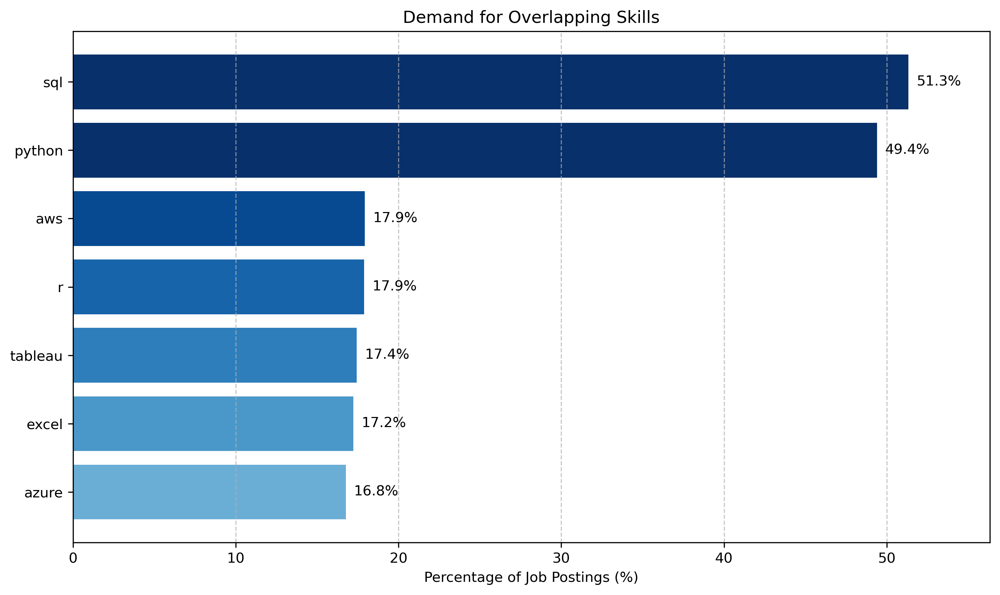

## [Overlapping Skills](../1_overlapping_skills/)
### Q1. What are the most in-demand overlapping skills from all three data-related domains?

### I. Query
---
The following SQL script identifies the most in-demand skills that overlap across all three data-related domains by creating a different Common Table Expression (CTE) for each domain to calculate skill counts, then joining the three CTEs to highlight the shared high-demand skills:

[1_overlapping_skills.sql](../1_overlapping_skills/1_overlapping_skills.sql)

### II. [Notebook](../1_overlapping_skills/overlapping_skills_bar_charts.ipynb)
---

### III. Interpretation
---

## [Data Science Skills](../2_data_science_domain/)

## [Data Engineering Skills](../3_data_engineering_domain/)

## [Senior Data Scientist Skills](../4_senior_data_scientist/4_I_most_in_demand_skills/)

## [Top-Paying Skills for the Senior Data Scientist Role](../4_senior_data_scientist/4_III_highest_paying/)

